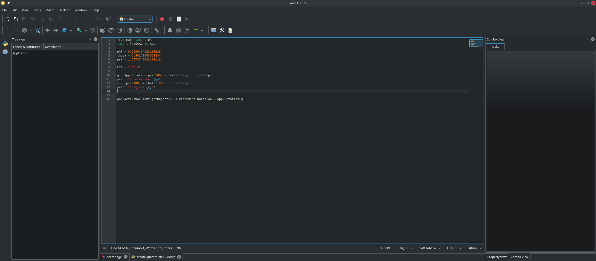
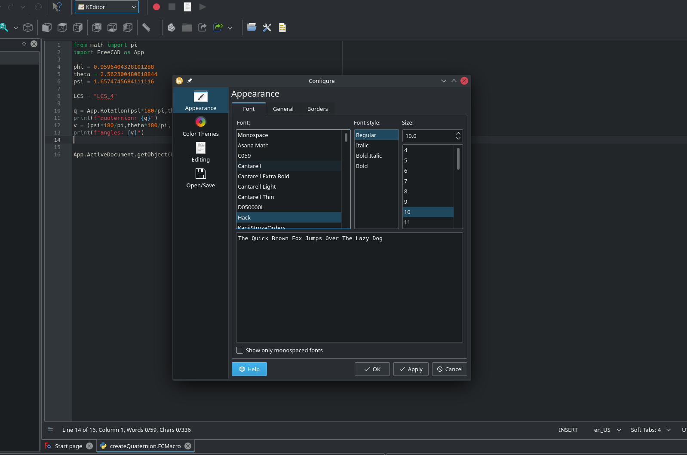

# Overview
This project uses shiboken2 to create python bindings of a QWidget containing
KTextEditor. This project is also configured as a FreeCAD workbench that uses the
python bindings to edit macro files (or any text document).

# How to install
The python bindings and the workbench can be build and installed by using
the setup file:

```
python setup.py install --user

```

The whole build system is really rough and may not work but it is a good initial
guess of how to create python bindings that can be loaded by FreeCAD.


# How to use KTextEditor in FreeCAD
The installed python package is a FreeCAD workbench that contains the needed
commands to open and edit python and macro files:



Also, the workbench contains a command that opens the configuration dialog for
KTextEditor which can be used to configure the style (colors, font, etc) for the
editor as well as other settings like line numbers, spell checking, and more:



# Limitations
1. The embedded editor is a bare bones KTextEditor which doesn't contain some neat
features like a python lsp client. Hopefully it could be added later.
2. The editor doesn't contain a debugger.
